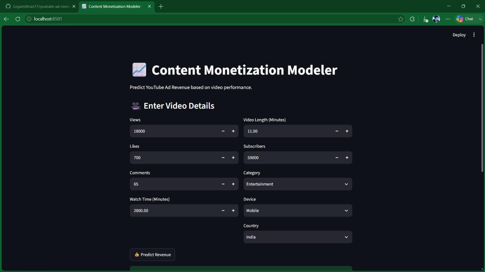
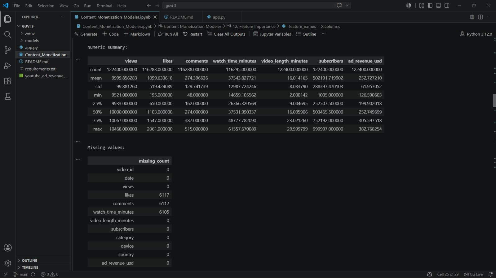
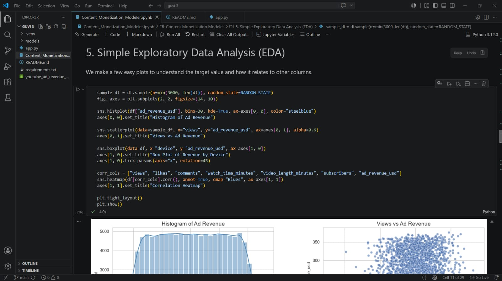
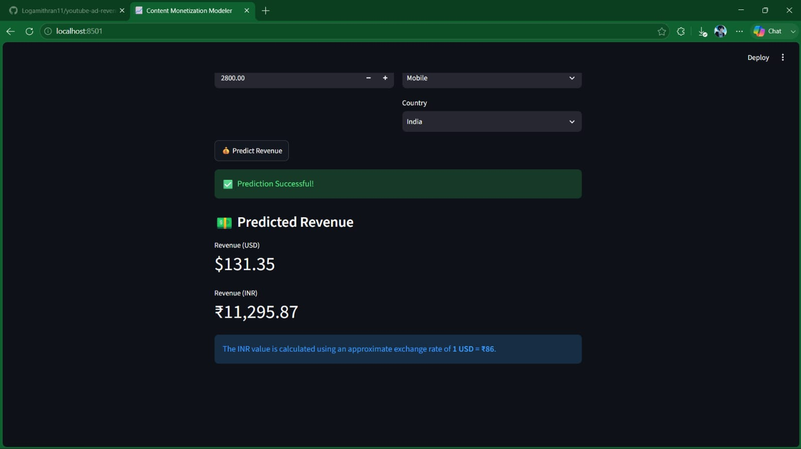
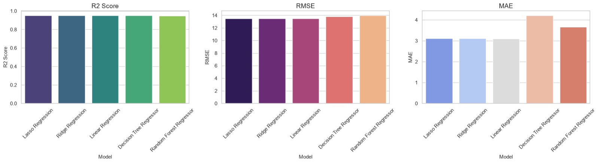
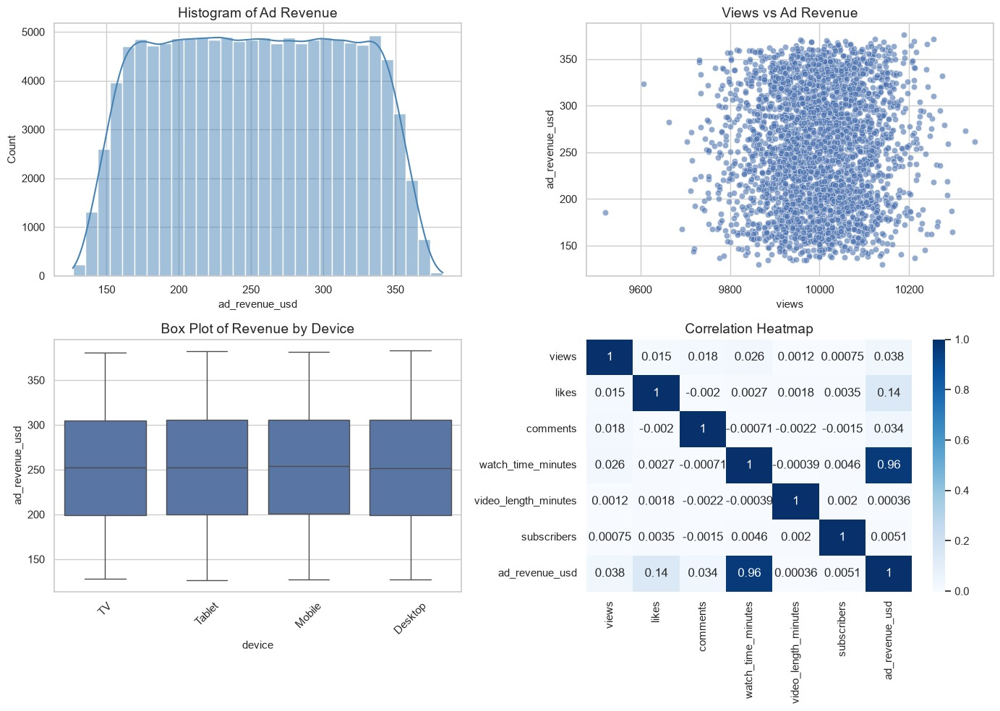

# 📈 Content Monetization Modeler

> 🚀 Predict YouTube Advertisement Revenue using Machine Learning Regression Models and an Interactive Streamlit Dashboard.

## 🌟 Project Overview

The **Content Monetization Modeler** is a Machine Learning project developed to estimate the **advertisement revenue generated by YouTube videos** based on video performance metrics and contextual information.

The project follows a complete Machine Learning workflow, including **data preprocessing, exploratory data analysis (EDA), feature engineering, model training, evaluation, and deployment using Streamlit**.

## 🎯 Objectives

- 📊 Analyze YouTube video performance data.
- 🧹 Clean and preprocess the dataset.
- ⚙️ Create meaningful features to improve predictions.
- 🤖 Train and compare multiple regression models.
- 📈 Predict YouTube Ad Revenue.
- 🌐 Deploy the model using Streamlit.

### Features

- 🎥 Video ID
- 📅 Date
- 👀 Views
- ❤️ Likes
- 💬 Comments
- ⏱️ Watch Time
- 🎞️ Video Length
- 👥 Subscribers
- 🎬 Category
- 📱 Device
- 🌍 Country
- 💰 Ad Revenue (Target)

# 🛠️ Tech Stack

| Category | Technologies |
|----------|--------------|
| Language | Python |
| Data Analysis | Pandas, NumPy |
| Visualization | Matplotlib, Seaborn |
| Machine Learning | Scikit-Learn |
| Deployment | Streamlit |
| Model Storage | Joblib |


# 🤖 Regression Models

✔️ Linear Regression

✔️ Ridge Regression

✔️ Lasso Regression

✔️ Decision Tree Regressor

✔️ Random Forest Regressor

# 📏 Evaluation Metrics

- 📊 R² Score
- 📉 Root Mean Squared Error (RMSE)
- 📌 Mean Absolute Error (MAE)

# 📸 Project Preview

## 🖥️ Streamlit Application



## 📊 Dataset Overview



## 📈 Exploratory Data Analysis



## 📊 Model Evaluation



## 🤖 Model Performance



## 💰 Revenue Prediction



# 📂 Project Structure

```text
Content-Monetization-Modeler/
│
├── data/
├── models/
├── screenshots/
├── Content_Monetization_Modeler.ipynb
├── app.py
├── requirements.txt
└── README.md
```

---

# 🚀 Installation

Clone the repository

```bash
git clone https://github.com/your-username/Content-Monetization-Modeler.git
```

Navigate into the project

```bash
cd Content-Monetization-Modeler
```

Install dependencies

```bash
pip install -r requirements.txt
```

Run the application

```bash
python -m streamlit run app.py
```

# 📌 Key Features

- ✅ Data Cleaning & Preprocessing
- ✅ Exploratory Data Analysis
- ✅ Feature Engineering
- ✅ Multiple Regression Models
- ✅ Model Comparison
- ✅ Interactive Streamlit Dashboard
- ✅ Revenue Prediction (USD & INR)

# 💡 Future Improvements

- 🌍 Deploy on Streamlit Cloud
- 📈 Add XGBoost & LightGBM
- 📊 Interactive Dashboard
- 🔄 Live Currency Conversion
- 📱 Mobile Responsive UI

# 🎓 Learning Outcomes

- Machine Learning Regression
- Data Cleaning
- Feature Engineering
- Model Evaluation
- Streamlit Deployment
- GitHub Project Management

# 👨‍💻 Author

**Logamithran B S**

🎓 Computer Science Engineering Student

🤖 AI & Machine Learning Enthusiast

💡 Passionate about Data Science and Intelligent Applications

# ⭐ Show Your Support

If you found this project useful:

⭐ Star this repository

🍴 Fork the repository

📢 Share your feedback

## 🙏 Acknowledgements

Special thanks to **GUVI**, **Scikit-Learn**, **Streamlit**, **Pandas**, and the **Python Open Source Community** for providing the tools and learning resources used in this project.
